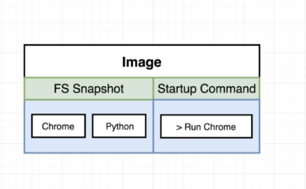
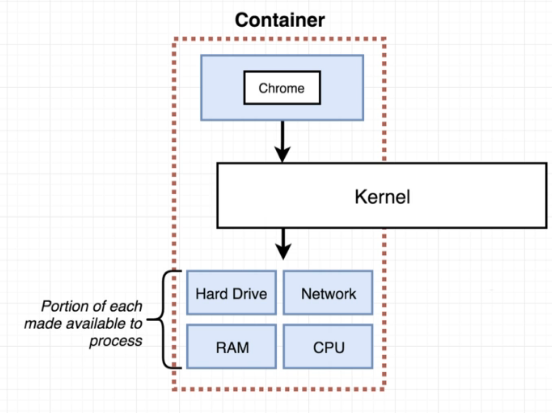
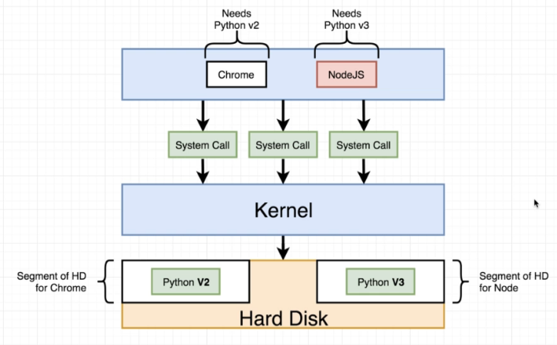
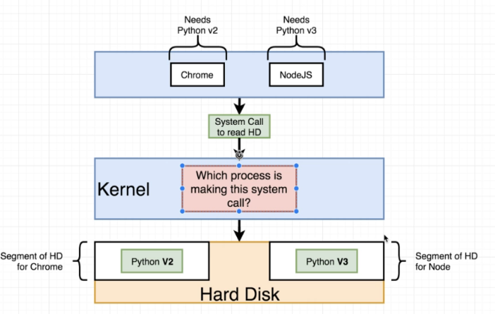

## What is Docker?
- "Docker is a platform or ecosystem around creating and running containers"
- Docker Ecosystem consists of Docker Client, Docker Server, Docker Machine, Docker Images, Docker Hub and Docker Compose
- Docker Client (Docker CLI) is a tool that we are going to issue commands to
- Docker Server (Docker Daemon) tool that is responsible for creating images, running containers etc. 

## Why use Docker?
- "Docker makes it really easy to install and run software without worrying about setup or dependencies"
- Docker wants to make it easy and straightforward to install and run software on any given computer
- Web servers and any cloudbased platform
- Normal way of installing leads to potential errors which takes time by finding ways on troubleshooting the issue

## Image

- "docker run -it redis" 
- When this command is ran, docker cli reached out to docker hub and downloaded an IMAGE
- An IMAGE is a single file which contains all the dependencies and configurations required to run a specific program
- This single file that gets stored on the harddrive 

## Container

- An image can then be used to create a CONTAINER
- A CONTAINER is an instance of an IMAGE
- Can think of it as a running program
- A CONTAINER is a program with its own isolated set of hardware resources such as its own little space of memory, networking etc. 
- Once a container has been created, we cannot change the command

## BTS 
- "docker run hello-world"
- This starts the Docker CLI and communicates with Docker Server thats in charge
- Start a new container using the image with the name "hello-world"
- "hello-world" image has a tiny program inside of it which its purpose is to print out the message
- Docker server first checks if theres a local copy on the personal machine. It checks the image cache
- Due to it not being installed, it checked Docker Hub and downloaded the "hello-world" file and is now stored in the image cache
- This means it is now stored locally and does not need to be downloaded from Docker Hub again
  
## Namespacing
- "Isolating resources per process (or group of processes)" 

- Imagine a scenario where Chrome needs Python v2 to run and NodeJS needs Python v3
- The hard disk is only allowed to have one installation of Python and already has Python v2 installed
- This means Chrome will work perfectly but NodeJS won't. How do we solve this?
- This is where namespacing comes
- With NAMESPACING we can look at all of the different hardware resources connected to our computer and segment out these resources
- Create a segment on our hard disk for Python v2 and another segment for Python v3

- To ensure that the right Python version is used the Kernel will check the incoming system call and figure out which process it is coming from and direct to which segment needed
- Namespacing is not only used for hardware, can be used for hard drive, network, inter process communication etc. 

## Control Groups (cgroups)
- "Limits amount of resources used per process"
- Can be used to limit amount of memory a process can use, the amount of cpu, the amount of network bandwith

## Commands
- "docker run <image name>" - Creating and running a container from an image
- "docker run <image name> command!" - This will override the startup command
- "docker run busybox echo hi there" - This overrides the startup command and prints "hi there" in the terminal
- "docker run busybox ls" - Lists folders inside the container
- "docker ps" - List all running containers
- "docker run busybox ping google.com" - This is a command that will attempt to ping google.com and measure latency
- "docker ps --all" - List of every container thats been created on our machine
- "docker run" = "docker create" + "docker start"
- "docker create <image name>" - Create a container
- "docker start -a <container id> - Start a container
- "-a" - Attach to container and print out any output onto terminal
- "docker system prune" - Delete containers, networks, dangling images, build cache
- "docker logs <container id>" - Get logs from a container (Does not rerun the container just gets logs)
- "docker stop <container id>" - Stops a container, sends a sigterm(Terminate Signal), gives the process bit of time to stop 
- "docker kill <container id>" - Kills a container, sends a sigkill, has to shutdown right now
- "docker exec -it <container id> <command>" - Execute an additional command in a container
- "alias docker="winpty docker"" - The input device is not a TTY.
- "-it" = "-i" and "-t"- allows you to interact with the container
- "docker exec -it <container id> sh" - sh is a name of a program, a program that is executed inside that container. sh is a shell and allows commands to be executed
- bash, powershell, zsh are examples of commmand processors
- "docker run -it <image name> sh" - Run the image and start shell
- CTRL D to exit shell
-  